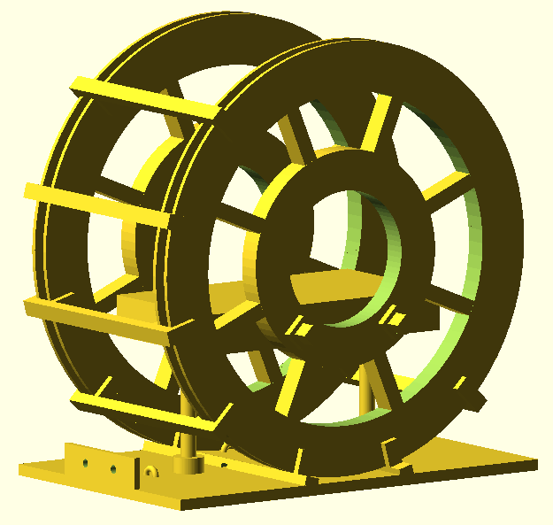

# Helmholtz coil simulation and 3D model

Forked from

http://hackaday.io/project/7409-highly-configurable-3d-printed-helmholtz-coil

## Summary

Helmholtz coils contain a region of uniform magnetic field which is common used to measure the strength of magnets, measure electrical charges at the atomic level and nulling out earths magnetic field. The magnetic field calculation is done for you.


## 3D model

[Helmholtz.scad](Helmholtz.scad)

This project uses OpenScad which is a 3D Solid modeler for 3D printing. OpenScad has the advantage that it's a programming language, which lends itself to heavy customization. You can custom everything, and if you don't like it or need something else, then change it.

The inner cylinder of the coils (the space that is 1/3 the diameter of coil), denotes the area of uniform magnetic field.

The platform for magnetic experiments is replaceable, so you can have switchable platforms for applications.



## Simulation

[helmholtz.py](helmholtz.py)

### Helmholtz Coil Configuration Statistics

    Mechanics
        Radius: 130 (inner 124.80) mm
        8 layers (H=10.40) of 6 wires (W=7.80)
        Packed winding (mm): H=9.22, W=8.45
        Winding enter & exit: same side
        Wire L=78.67 m, M=0.415 kg
             Litz 0.1 mm x 75 strands
        Physical diameter: 276.4 mm
    Circuit
        Resistance DC: 2.30 Ohm
        Resistance 1kHz: 16.31 Ohm
        Inductance: 2.57 mH
        Current: 2 A
    Magnetics
        B0 at center: 0.664 mT
        Homogeneous region (tol=0.01): 81 mm


### Quick launch

The simulation is executed in Python with Magpylib. To replicate the simulation, run

```
$ pip install -r requirements.txt
$ python helmholtz.py
```

### Magpylib simulation

The coil is simulated as a set of closed loop currents of the same direction (winding).
On the figure below, the coils are oriented vertically, and the uniform magnetic field in the center of the coils is oriented along the X axis.
The distance between the coil equals the coil radius (*Helmholtz coil*).


Magnetic field and its strength along the X axis is shown below.


